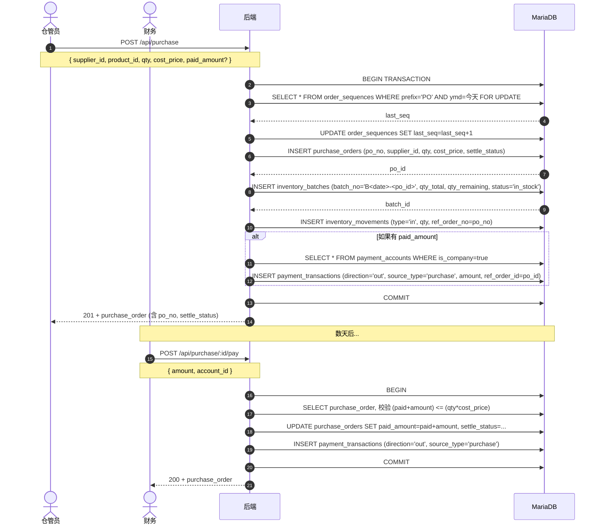
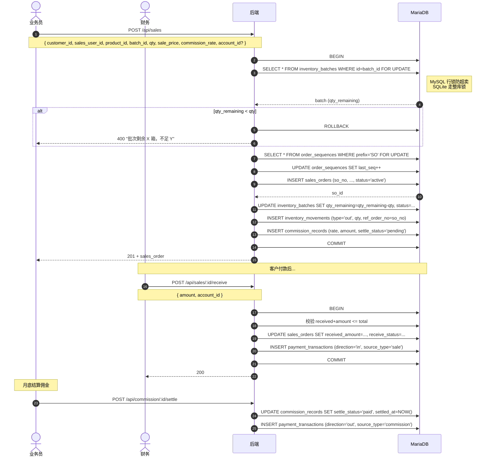
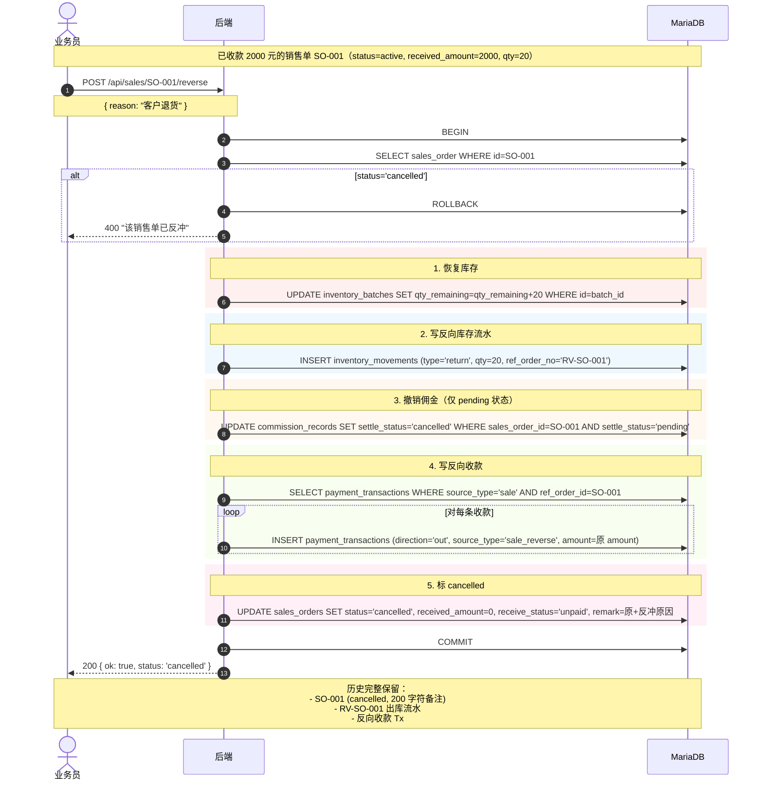
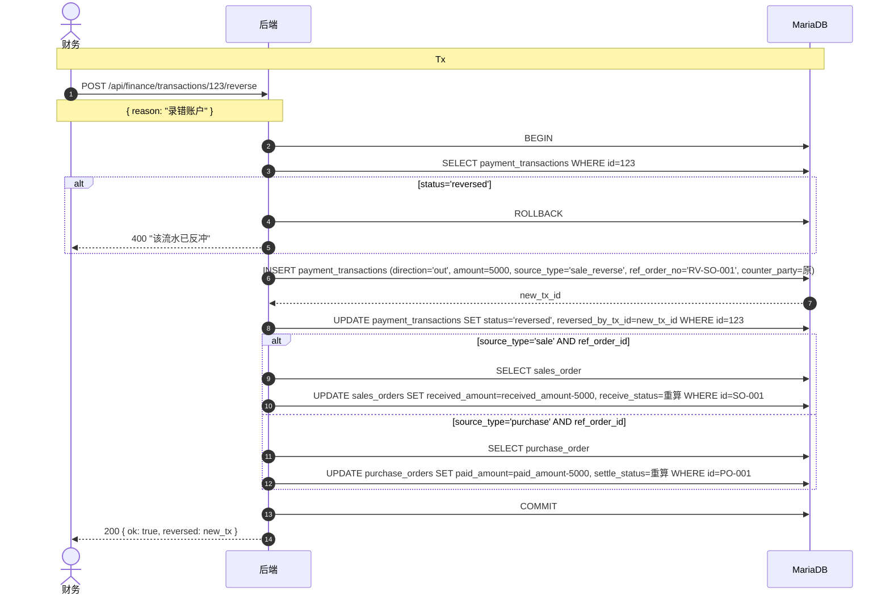
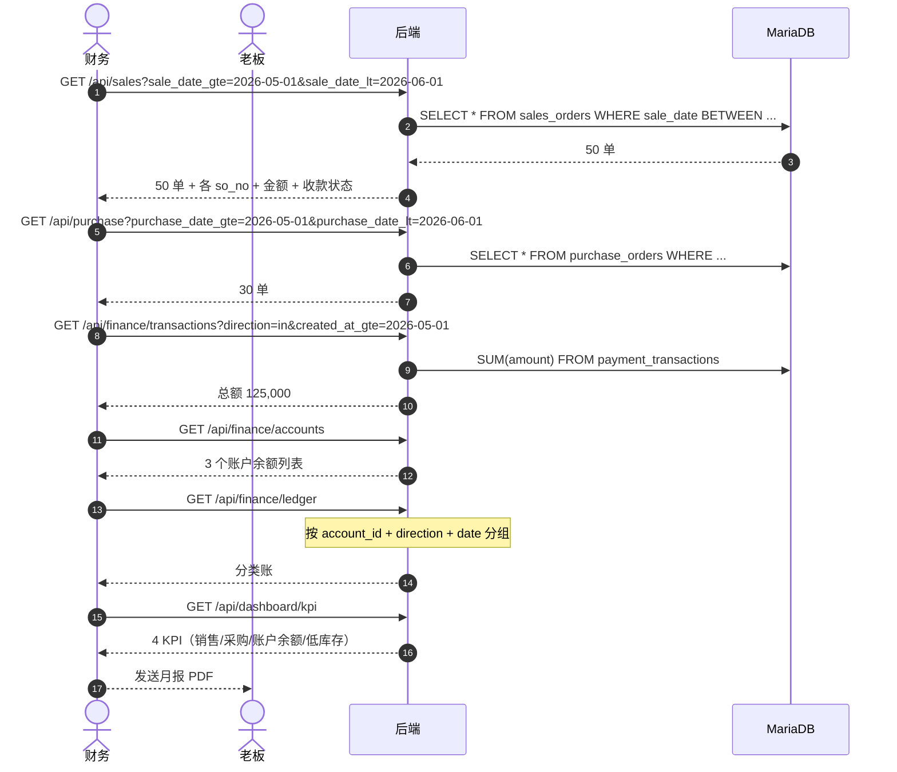
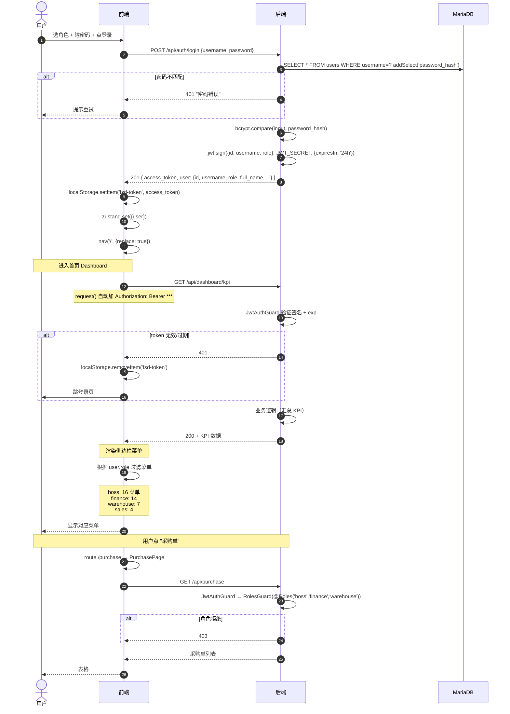
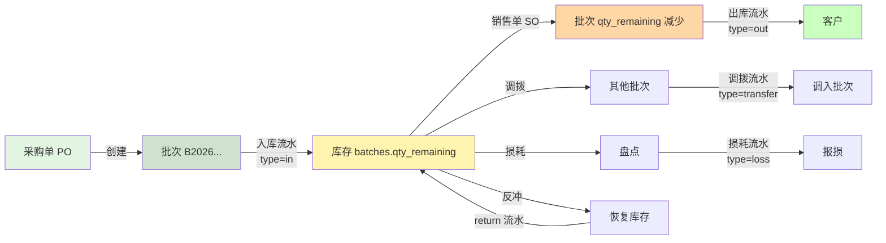
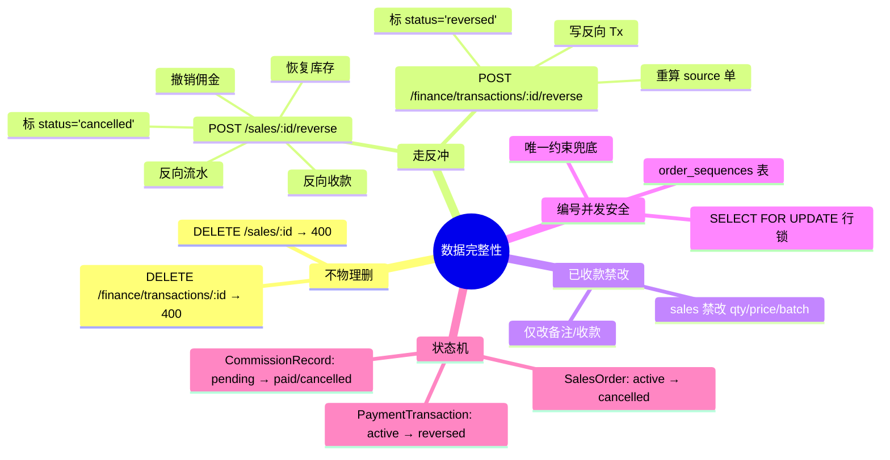
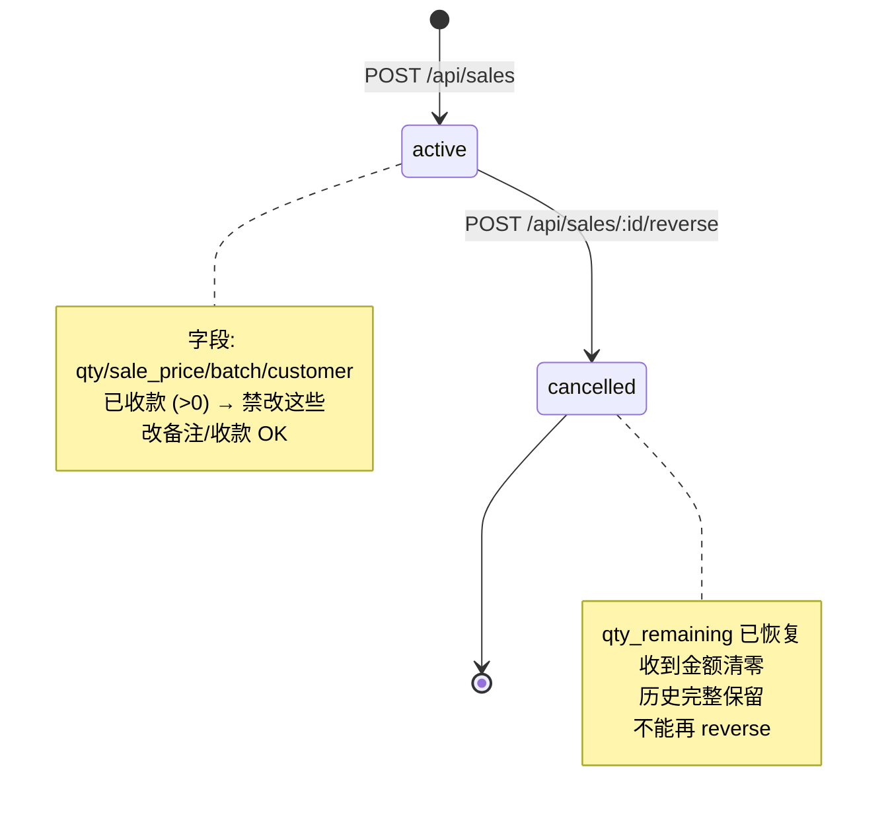
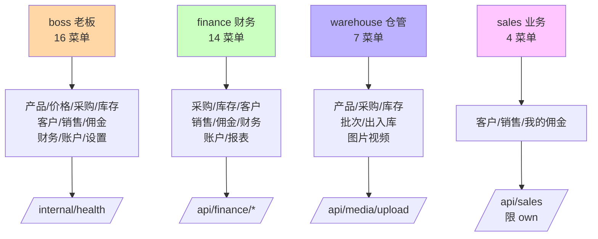

# 业务流程时序图

> 业务培训 + 新人 onboarding 材料。可在 GitHub / VS Code / Typora 直接渲染。

## 目录

- [1. 采购流程](#1-采购流程)
- [2. 销售流程](#2-销售流程)
- [3. 销售反冲流程](#3-销售反冲流程)
- [4. 财务反冲流程](#4-财务反冲流程)
- [5. 月度对账流程](#5-月度对账流程)
- [6. 用户登录 + 权限流程](#6-用户登录--权限流程)

---

## 1. 采购流程

**业务场景**：仓管员录入采购单 → 自动建批次 + 入库流水 → 财务付款。

---

## 2. 销售流程

**业务场景**：业务员开销售单 → 扣库存 + 出库流水 + 佣金记录 → 财务收款。

---

## 3. 销售反冲流程

**业务场景**：发现销售单录错 / 客户退货 → 走反冲（不物理删单，保留历史）。

---

## 4. 财务反冲流程

**业务场景**：发现某条财务流水录错（金额/账户/对手方）→ 反冲。

---

## 5. 月度对账流程

**业务场景**：财务每月 1 号对上月的销售 + 采购 + 收付款做汇总对账。

---

## 6. 用户登录 + 权限流程

**业务场景**：4 角色登录 + 看到不同菜单 + 不同操作权限。

---

## 7. 库存批次流转（采购→销售全链）

---

## 8. 数据完整性（业务"反冲"原则）

---

## 9. 状态机：销售单

---

## 10. 角色权限矩阵

---

**mermaid 渲染提示**：
- GitHub：直接看 `.md` 文件
- VS Code：装 `Markdown Preview Mermaid Support` 插件
- Typora：原生支持
- 在线：https://mermaid.live/ 粘文本看图
